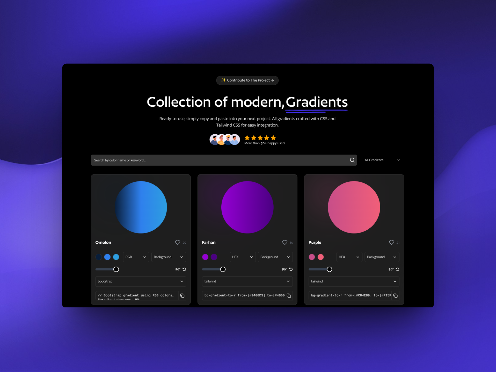

# Gradients CSS



Gradients CSS is a modern, open-source React application for browsing, searching, and copying CSS gradients. Built with Vite, React, and Tailwind CSS, this project provides a clean user interface, advanced filtering, and easy integration for your web projects.

## Features

- Gradient Gallery: Browse a curated collection of modern CSS gradients.
- Search & Filter: Find gradients by color name, keyword, or favorites.
- Favorites: Save your favorite gradients locally for quick access.
- Copy to Clipboard: Instantly copy CSS or Tailwind code for any gradient.
- Responsive UI: Mobile-friendly design with animated effects.
- Fast & Lightweight: Powered by Vite and optimized for performance.
- Customizable: Easily theme and extend with global CSS variables.

## Getting Started

### Prerequisites
- Node.js (v18 or higher recommended)
- pnpm, npm, or yarn

### Installation

```bash
# Clone the repository
git clone https://github.com/balshaer/gradients-css.git
cd gradients-css

# Install dependencies
pnpm install # or npm install or yarn install
```

### Running the Application

```bash
pnpm dev # or npm run dev or yarn dev
```

The application will be available at [http://localhost:5173](http://localhost:5173) by default.

## Project Structure

```
app/
  css/           # Global styles and variables
  assets/        # Images and cover assets
src/
  components/    # Reusable UI and layout components
  pages/         # Main pages (Home, NotFound, etc.)
  data/          # Gradient data and links
  hooks/         # Custom React hooks
  lib/           # Utility functions
  routes/        # App routes
  types/         # TypeScript types
  ...
```

## Customization

- Colors & Theme: Edit `src/index.css` to change global color variables (including grid color, backgrounds, etc).
- Gradient Data: Update or extend `src/data/gradients.json` for your own collection.

## Contributing

Contributions are welcome. Please open issues or pull requests for new features, bug fixes, or improvements.

1. Fork the repository
2. Create your feature branch (`git checkout -b feature/YourFeature`)
3. Commit your changes (`git commit -am 'Add new feature'`)
4. Push to the branch (`git push origin feature/YourFeature`)
5. Open a Pull Request

## License

This project is licensed under the MIT License.

---

Developed by [balshaer](https://github.com/balshaer) and contributors.
